<!-- markdownlint-disable MD033 MD036 MD041 -->

<p align="center">
  <a href="https://v2.nonebot.dev/"></a>
</p>

<div align="center">

nonebot-plugin-access-control
============

_✨ Nonebot 权限控制 ✨_

</div>


<p align="center">
  <a href="https://raw.githubusercontent.com/ssttkkl/nonebot-plugin-access-control/master/LICENSE">
    
  </a>
  <a href="https://pypi.python.org/pypi/nonebot-plugin-access-control">
    
  </a>
  
</p>

## 特点

- 功能
    - [x] 支持针对用户/群组的权限开关
    - [x] 支持限制同一用户在一定时间内的指令调用次数
    - [x] 对未适配插件提供**插件级别**的控制支持
- 插件适配
    - [x] 支持**功能级别**的细粒度控制
    - [x] 支持对权限开关等事件进行订阅

## 使用

### 主体

#### 概念

让我们从一个例子引入：QQ上群组G的用户U发送了一条消息，该用户同时具有“用户U”、“群组G成员”、“QQ用户”、“Bot用户”这几个身份。同时QQ上群组G的用户V也发送了一条消息，该用户该用户同时具有“用户V”、“群组G成员”、“QQ用户”、“Bot用户”这几个身份。

如果我们希望对用户进行权限控制，我们可以直接针对“用户U”、“用户V”这个级别分别配置权限。但我们希望对群组进行权限控制时，对群组内的每一个用户都分别配置权限，就有点力不从心了。我们希望能够直接针对“群组G”这个级别进行配置，而无需关心群组内都有什么成员。

我们定义**主体（Subject）为用户所具有的身份，也是设置权限的基本单位。**

一个用户通常拥有多个主体。回到上面的例子，第一位用户拥有“用户U”、“群组G成员”、“QQ用户”、“Bot用户”这四个主体；第二位用户拥有“用户V”、“群组G成员”、“QQ用户”、“Bot用户”这四个主体。用户拥有的所有主体，按照规模从小到大排序，呈现如下图的逐层包含关系：



当设置权限时，我们直接针对一个主体进行设置。当鉴权时，我们对用户的所有主体按规模从小到大的顺序（下文将此顺序称为优先级顺序），逐一检查是否设置了权限。一旦检查到某个主体设置了权限，就以该主体设置的权限作为该用户的权限。

回到上面的例子，假设我们对主体”群组G“禁用服务，但是对主体”用户V“启用服务。则用户U在群组G内将无法使用服务，但是用户V在群组G内可以使用。

#### 应用

在实际应用中，我们用一个字符串表示主体。并且我们约定，`all`表示所有用户，`<协议名>`表示所有此协议的用户，除此之外的所有主体均以`<协议名>:`开头。

在OneBot协议中，每个用户所拥有的主体如下表所定义：

| 主体                 | 含义       | 示例               | 必定存在             |
|--------------------|----------|------------------|------------------|
| onebot:<user_id>   | 用户       | onebot:12345678  | 是                |
| onebot:g<group_id> | 群组       | onebot:g87654321 | 仅当消息来自群组或临时会话时存在 |
| onebot             | OneBot用户 | onebot           | 是                |
| all                | 所有用户     | all              | 是                |

目前仅实现了OneBot协议。如果你能帮助我们进行其他协议适配，欢迎提交PR。

### 服务

**服务（Service）为一组能够进行权限控制的功能的集合。** 服务可以拥有子服务，通过树形结构组织服务，统一管理权限。

整个NoneBot是一个名为nonebot的服务，为树形结构的根节点，其直接子节点为所有插件。

一个插件是一个服务（PluginService），其父节点为nonebot。

当插件未进行适配时，该插件只具有这一个PluginService。 对插件进行适配，则需要从插件的PluginService创建SubService，为插件的Matcher等功能入口应用SubService。（参考下文插件适配章节）

（为防止意外发生，nonebot_plugin_access_control本身不可以进行权限开关）

### 指令

进行控制的指令为`/ac`，仅超级用户可用。（通过在配置文件中设置`SUPERUSERS`变量可设置超级用户）

（注意：0.3.0版本对指令进行了一次大的更改）

- 帮助
    - /ac help：显示此帮助
- 权限控制
    - /ac permission allow --sbj <主体> --srv <服务>：为主体启用服务
    - /ac permission deny --sbj <主体> --srv <服务>：为主体禁用服务
    - /ac permission rm --sbj <主体> --srv <服务>：为主体删除服务权限配置
    - /ac permission ls：列出所有已配置的权限
    - /ac permission ls --sbj <主体>：列出主体已配置的服务权限
    - /ac permission ls --srv <服务>：列出服务已配置的主体权限
    - /ac permission ls --sbj <主体> --srv <服务>：列出主体与服务已配置的权限
- 流量限制
    - /ac limit add --sbj <主体> --srv <服务> --limit <次数> --span <时间间隔>：为主体与服务添加限流规则（按照用户限流）
    - /ac limit rm <规则ID>：删除限流规则
    - /ac limit ls：列出所有已配置的限流规则
    - /ac limit ls --sbj <主体>：列出主体已配置的限流规则
    - /ac limit ls --srv <服务>：列出服务已配置的限流规则
    - /ac limit ls --sbj <主体> --srv <服务>：列出主体与服务已配置的限流规则
    - /ac limit reset：重置限流计数
- 服务查看
    - /ac service ls：列出所有服务与子服务层级
    - /ac service ls --srv <服务>：列出服务的子服务层级

其中`<服务>`的格式如下：

- `nonebot`：对整个NoneBot进行开关
- `<插件名>`：对整个插件进行开关
- `<插件名>.<子服务名>.<子服务名>.....<子服务名>`：对插件内的某个子服务进行开关（需参照下文对插件进行配置）

### 示例

首先编辑配置文件，打开对未适配插件的支持：

```
ACCESS_CONTROL_AUTO_PATCH_ENABLED=true
```

假设bot加载了内置插件echo

```python
nonebot.load_builtin_plugins("echo")
```

执行下面的指令后，用户12345678将无法调用指令`/echo`

```
/ac subject onebot:12345678 deny service echo
```

执行下面的指令后，用户12345678将无法调用所有指令

```
/ac subject all deny service nonebot
```

执行下面的指令后，群组87654321的所有用户（用户12345678除外）将无法调用指令`/echo`

```
/ac subject onebot:12345678 allow service echo
/ac subject onebot:g87654321 deny service echo
```

执行下面的指令后，所有用户将无法调用指令`/echo`

```
/ac subject all deny service echo
```

## 插件适配

完整代码：[src/nonebot_plugin_ac_demo/matcher_demo.py](src/nonebot_plugin_ac_demo/matcher_demo.py)

1. 创建一个名为nonebot_plugin_ac_demo的插件

2. 通过create_plugin_service函数创建一个PluginService实例（注意参数必须为插件包名）

```python
from nonebot import require

require("nonebot_plugin_access_control")

from nonebot_plugin_access_control.service import create_plugin_service

plugin_service = create_plugin_service("nonebot_plugin_ac_demo")
```

3. 通过PluginService.create_subservice创建SubService实例。调用`Service.patch_matcher()`应用至Matcher

```python
group1 = plugin_service.create_subservice("group1")

a_matcher = on_command('a')
a_service = group1.create_subservice('a')
a_service.patch_matcher(a_matcher)


@a_matcher.handle()
async def _(matcher: Matcher):
    await matcher.send("a")


b_matcher = on_command('b')
b_service = group1.create_subservice('b')
b_service.patch_matcher(b_matcher)


@b_matcher.handle()
async def _(matcher: Matcher):
    await matcher.send("b")


c_matcher = on_command('c')
c_service = plugin_service.create_subservice('c')
c_service.patch_matcher(c_matcher)


@c_matcher.handle()
async def _(matcher: Matcher):
    await matcher.send("c")
```

插件服务的结构如下所示：



4. 通过指令配置服务权限

执行下面的指令后，所有用户将无法调用指令`/a`与`/b`

```
/ac subject all deny service nonebot_plugin_ac_demo.group1
```

执行下面的指令后，用户12345678将无法调用指令`/a`

```
/ac subject onebot:12345678 deny service nonebot_plugin_ac_demo.group1.a
```

执行下面的指令后，群组87654321的所有用户将无法调用除`/c`以外的任何指令

```
/ac subject onebot:g87654321 deny service nonebot_plugin_ac_demo
/ac subject onebot:g87654321 allow service nonebot_plugin_ac_demo.c
```

5. 手动鉴权

对于非Matcher的功能入口（如APScheduler的定时任务等），需要开发者手动进行鉴权。

- 方法一：调用`service.check(Bot, Event)`方法，传入Bot及Event实例，返回bool值表示该用户是否具有权限
- 方法二：调用`service.check_by_subject(*str)`方法，传入主体字符串，返回bool值表示该用户是否具有权限

APScheduler示例：[src/nonebot_plugin_ac_demo/apscheduler_demo.py](src/nonebot_plugin_ac_demo/apscheduler_demo.py)

6. 事件订阅

通过`service.on_set_permission`、`service.on_remove_permission`、`service.on_change_permission`方法可以订阅事件，具体如下表：

| 装饰器                            | 事件类型                                  | 事件接收函数的参数                   |
|--------------------------------|---------------------------------------|-----------------------------|
| `service.on_set_permission`    | 服务设置主体权限                              | service：服务<br>permission：权限 |
| `service.on_remove_permission` | 服务删除主体权限                              | service：服务<br>subject：主体    |
| `service.on_change_permission` | 服务变更主体权限（包括该服务及其所有祖先服务设置、删除权限导致的权限变更） | service：服务<br>permission：权限 |

**调用事件接收函数时通过具名参数传参，因此事件接收函数的参数必须严格遵循参数名。**

事件订阅示例：[src/nonebot_plugin_ac_demo/event_demo.py](src/nonebot_plugin_ac_demo/event_demo.py)

## 配置项

### datastore_database_url

（来自[nonebot-plugin-datastore](https://github.com/he0119/nonebot-plugin-datastore)）

数据库连接字符串，默认使用 SQLite 数据库

默认值：`sqlite+aiosqlite:///data_dir/data.db`

### access_control_default_permission

未设置权限时的默认行为

可选值：`allow`, `deny`

默认值：`allow`

### access_control_auto_patch_enabled

是否启用对未适配插件的权限控制

默认值：`False`

### access_control_auto_patch_ignore

对指定的未适配插件将不启用权限控制

默认值：`[]`

### access_control_reply_on_permission_denied

因无权限而拒绝执行时向用户回复的消息（None则不回复）

默认值：`None`

### access_control_reply_on_rate_limited

因到达最大次数而拒绝执行时向用户回复的消息（None则不回复）

默认值：`None`

## Q&A

### **本插件与[nonebot_plugin_rauthman](https://github.com/Lancercmd/nonebot_plugin_rauthman)
和[nonebot-plugin-manager](https://github.com/nonepkg/nonebot-plugin-manager)等其他权限管理插件有什么差别？**

[nonebot_plugin_rauthman](https://github.com/Lancercmd/nonebot_plugin_rauthman)
支持功能级别的细粒度权限控制，但是需要插件进行适配，对于未适配插件不起作用。[nonebot-plugin-manager](https://github.com/nonepkg/nonebot-plugin-manager)
则实现了非侵入式的权限控制。

本插件主要受这两个插件的启发，结合了这两个插件的优点。既支持非侵入式应用到原有插件，也支持对插件进行适配以获得更多feature。同时提供事件订阅机制，以便插件开发者更灵活处理权限。

同时，上述两款插件均只支持OneBot V11协议，而本插件设计之初就考虑到了除OneBot V11以外的协议，具有更强的可扩展性。

## 在线乞讨

<details><summary>点击请我打两把maimai</summary>


</details>

## LICENSE

> MIT License
>
> Copyright (c) 2022 ssttkkl
>
> Permission is hereby granted, free of charge, to any person obtaining a copy
> of this software and associated documentation files (the "Software"), to deal
> in the Software without restriction, including without limitation the rights
> to use, copy, modify, merge, publish, distribute, sublicense, and/or sell
> copies of the Software, and to permit persons to whom the Software is
> furnished to do so, subject to the following conditions:
>
> The above copyright notice and this permission notice shall be included in all
> copies or substantial portions of the Software.
>
> THE SOFTWARE IS PROVIDED "AS IS", WITHOUT WARRANTY OF ANY KIND, EXPRESS OR
> IMPLIED, INCLUDING BUT NOT LIMITED TO THE WARRANTIES OF MERCHANTABILITY,
> FITNESS FOR A PARTICULAR PURPOSE AND NONINFRINGEMENT. IN NO EVENT SHALL THE
> AUTHORS OR COPYRIGHT HOLDERS BE LIABLE FOR ANY CLAIM, DAMAGES OR OTHER
> LIABILITY, WHETHER IN AN ACTION OF CONTRACT, TORT OR OTHERWISE, ARISING FROM,
> OUT OF OR IN CONNECTION WITH THE SOFTWARE OR THE USE OR OTHER DEALINGS IN THE
> SOFTWARE.
> 
